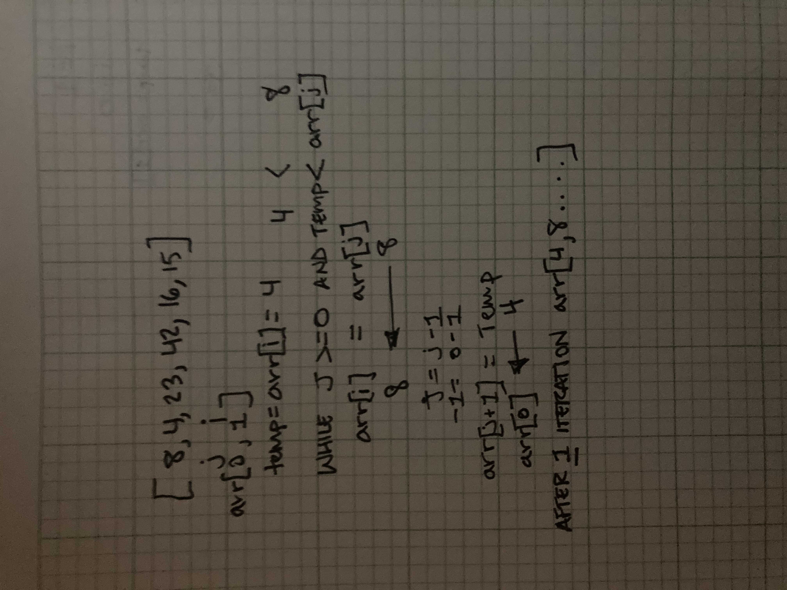

# Blog

## Pseudocode

 InsertionSort(int[] arr)

    FOR i = 1 to arr.length

      int j <-- i - 1
      int temp <-- arr[i]

      WHILE j >= 0 AND temp < arr[j]
        arr[j + 1] <-- arr[j]
        j <-- j - 1

      arr[j + 1] <-- temp

## Sample Arrays

In your blog article, visually show the output of processing this input array:

[8,4,23,42,16,15]

## Implementation

Provide a visual step through for each of the sample arrays based on the provided pseudo code

Convert the pseudo-code into working code in your language

[Solution](./blog.test.js)

Present a complete set of working tests
