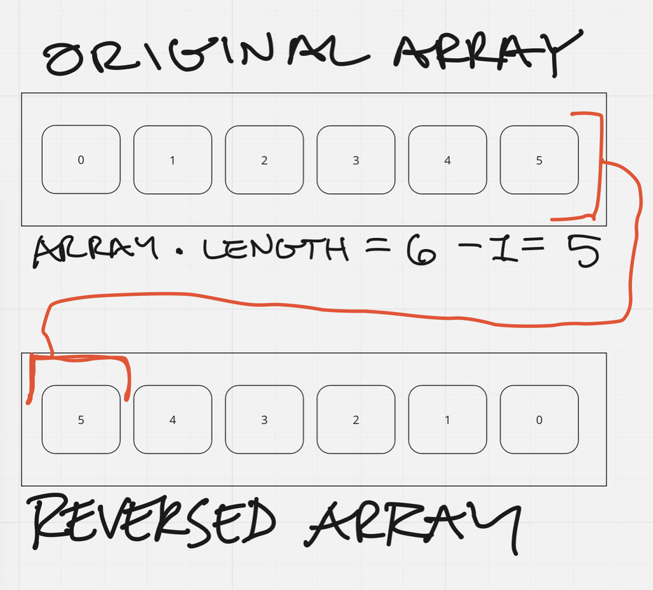

# Feature Tasks

- Write a function called reverseArray which takes an array as an argument. Without utilizing any of the built-in methods available to your language, return an array with elements in reversed order

## Examples

- Input / Output
  - [1, 2, 3, 4, 5, 6]/[6, 5, 4, 3, 2, 1]
  - [89, 2354, 3546, 23, 10, -923, 823, -12]/[-12, 823, -923, 10, 23, 3546, 2354, 89]
  - [2, 3, 5, 7, 11, 13, 17, 19, 23, 29, 31, 37, 41, 43, 47, 53, 59, 61, 67, 71, 73, 79, 83, 89, 97, 101, 103, 107, 109, 113, 127, 131, 137, 139, 149, 151, 157, 163, 167, 173, 179, 181, 191, 193, 197, 199]/[199, 197, 193, 191, 181, 179, 173, 167, 163, 157, 151, 149, 139, 137, 131, 127, 113, 109, 107, 103, 101, 97, 89, 83, 79, 73, 71, 67, 61, 59, 53, 47, 43, 41, 37, 31, 29, 23, 19, 17, 13, 11, 7, 5, 3, 2]

## Structure and Testing

- Utilize the Single-responsibility principle: any methods you write should be clean, reusable, abstract component parts to the whole challenge. You will be given feedback and marked down if you attempt to define a large, complex algorithm in one function definition.

## Stretch Goal

- Once you’ve achieved a working solution, implement the same feature with a different methodology. (Hint: what different techniques do you have when working with arrays? Recursion, loops, indexes, modifying the array input directly…)

- In other words, use a different algorithm & pseudocode to solve the same problem. Then compare approaches for efficiency, readability, flexibility, etc.

## Solution

### Algorithm

If a for loop can start at the beginning and increment towards the end, can it start at the end and decrement towards the beginning?

- create an empty reversedArray
- use a for loop to iterate backwards through the originalArray
- push each originalArray[ i ] into the reversedArray

### Pseudocode

function reverseArray takes in an array
  declares an empty array

  begins for loop: i starts as the length of array minus 1; i will be greater than 0; i will decrement by 1 each iteration

    takes the element at i's position in the original array and pushes into the reversed array
  
  returns the reversed array

### Visual Aid

