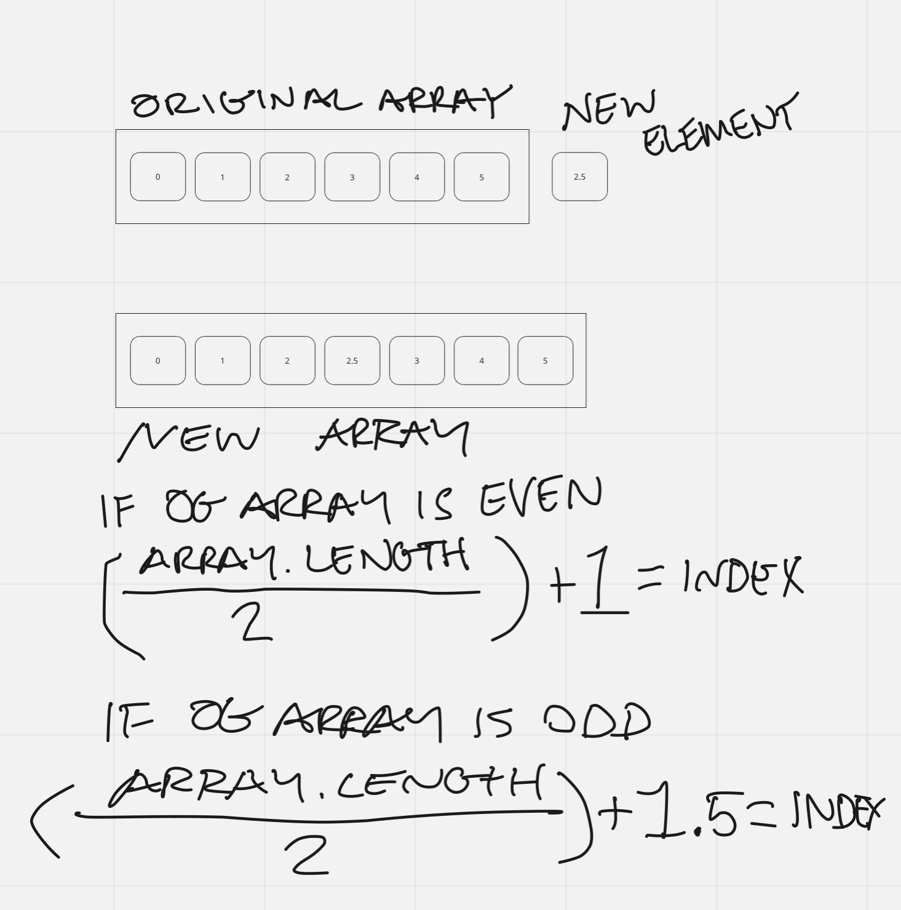

# Feature Tasks

Write a function called insertShiftArray which takes in an array and a value to be added. Without utilizing any of the built-in methods available to your language, return an array with the new value added at the middle index.

## Example

- Input	/ Output
  - [2,4,6,-8], 5 /	[2,4,5,6,-8]
  - [42,8,15,23,42], 16	/ [42,8,15,16,23,42]

## Stretch Goal

Write a second function that removes an element from the middle index and shifts other elements in the array to fill the new gap.

## Solution:

### Algorithm

Insert new element into the middle of an array

- create an empty newArray
- create variable for index with initial value of 0 (zero)
- Find the middle index position of the originalArray
  - check if originalArray.length is even or odd
  - divide originalArray.length by 2
    - if even: index = result + 1
    - if odd: index = result + 1.5
- For loop iterates over each element in originalArray
  - if current iteration is less than index:
    - the ogArray element gets pushed into the newArray
  - if current iteration equals index:
    - the newElement gets pushed into the newArray at that index number
    - ogArray element is then pushed
  - if current iteration is greater than index:
    - ogArray element is pushed into newArray

### Pseudocode

function insertShiftArray takes in an array and a value
  declares an empty array
  declares a valueToInsert that equals value argument
  declares an index variable with intitial value of 0

  if (ogArray.length / 2 === 0), then index = ogArray.length + 1
  if (!ogArray.length / 2 === 0), then index = ogArray.length + 1.5

  for-loop: i = 0; < .length + 1; i++
    if (i < index), then newArray.push(ogArray[i])
    else if (i === index), then newArray.push(valueToInsert, array[i])
    else if (i > index), then newArray.push(array[i])
    else console.log error

  return newArray

### Visual Aid

