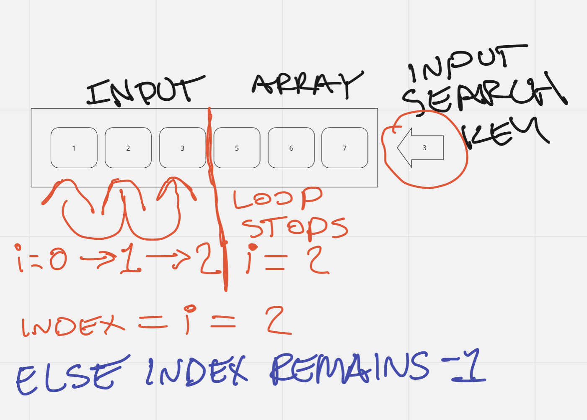

# Code Challenge Three

## Feature Tasks

- Write a function called BinarySearch which takes in 2 parameters:

  1. a sorted array
  2. the search key

- Without utilizing any of the built-in methods available to your language, return the index of the array’s element that is equal to the value of the search key, or -1 if the element is not in the array

- NOTE: The search algorithm used in your function should be a binary search

## Example

- Input/Output
  - [4, 8, 15, 16, 23, 42], 15 => 2
  - [-131, -82, 0, 27, 42, 68, 179], 42 => 4
  - [11, 22, 33, 44, 55, 66, 77], 90 => -1
  - [1, 2, 3, 5, 6, 7], 4 => -1

## Solution

### Algorithm

BinarySearch takes in an array and a search key. It loops through the array and finds the element whose value matches the key. It returns the index number of that element. If no elements match the search key, this function returns -1.

### Pseudocode

- let indexPosition have an intitial value of -1

- open a for-loop where i = 0; < inputArray.length; i++

  - if inputArray[ i ] = searchKey then indexPosition = i

- close for-loop

- return indexPosition

### Visual Aid

