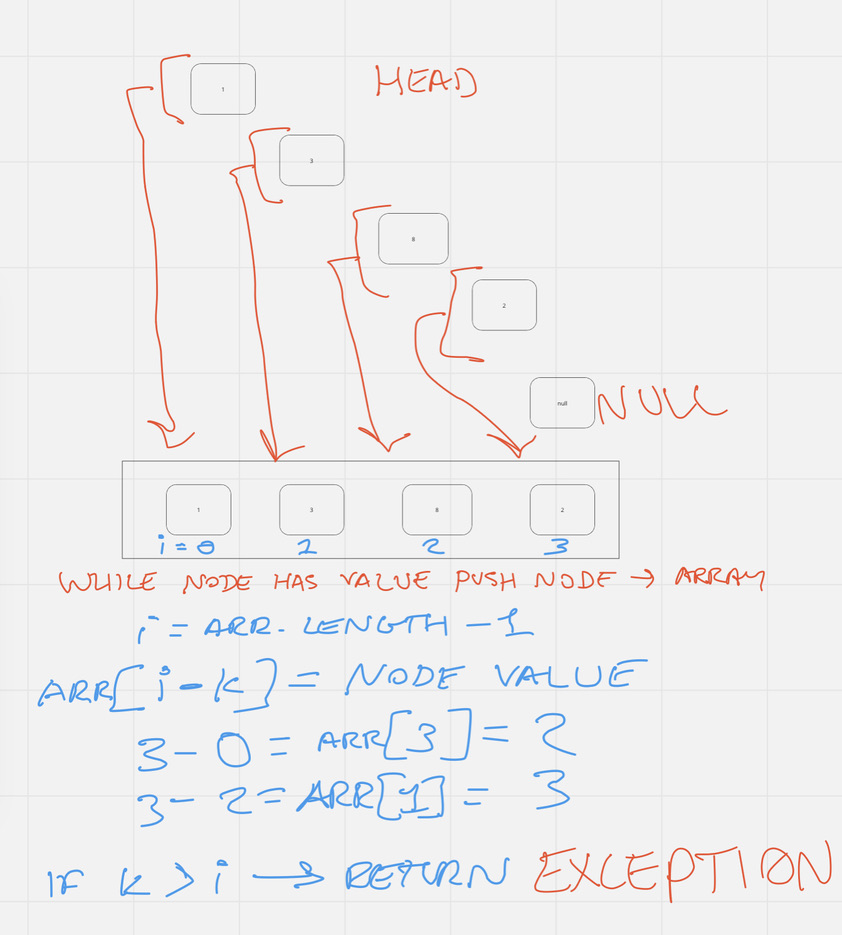

# Feature Tasks

Write the following method for the Linked List class:

- kth from end
  - argument: a number, k, as a parameter.
  - Return the node’s value that is k places from the tail of the linked list.
  - You have access to the Node class and all the properties on the Linked List class as well as the methods created in previous challenges

## Example

Input | Argument | Output

- head -> [1] -> [3] -> [8] -> [2] -> X | 0 | 2

- head -> [1] -> [3] -> [8] -> [2] -> X | 2 | 3

- head -> [1] -> [3] -> [8] -> [2] -> X | 6 | Exception

## [Solution Code](./challenge-07.test.js)

### Algorithm

This functions takes in a number (k) and a LinkedList. It creates an array of the linked list's values and returns the value which is k places from the tail.

### Pseudocode

- declares an empty nodeArray and a nodeValue with an initial value of the string: Exception

- loops through the linked list as long as the current node contains a value, and pushes that value into the nodeArray

- declares an index with the value of the length of the array - 1
  - if index is less than the value of k, it returns nodeValue
  - else it sets nodeValue to equal value of the element at arr[index - k] and returns nodeValue

### Visual Aid

